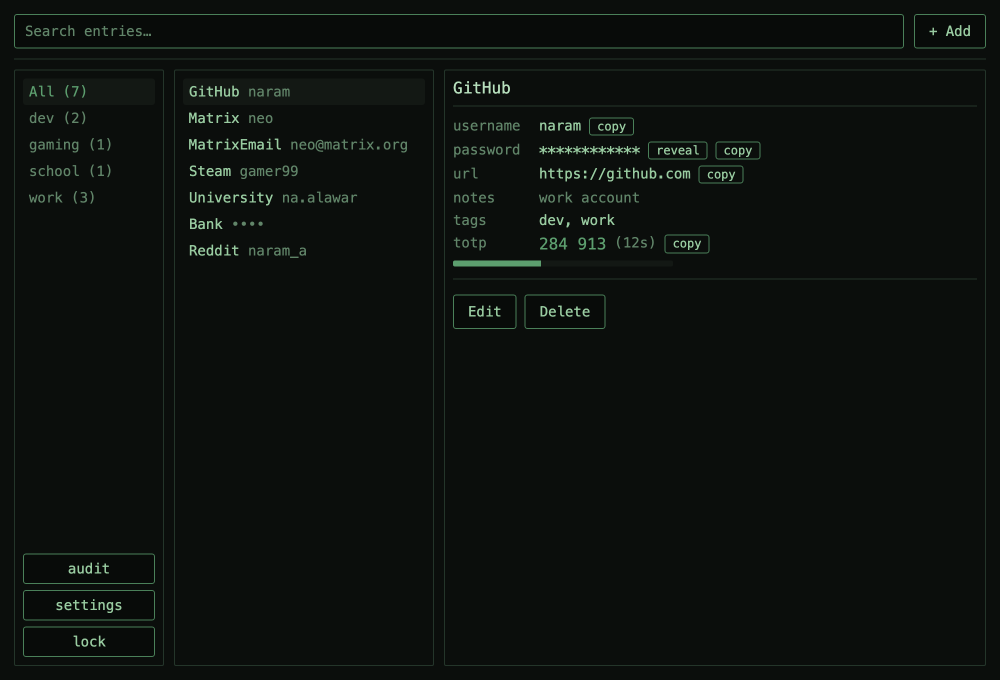
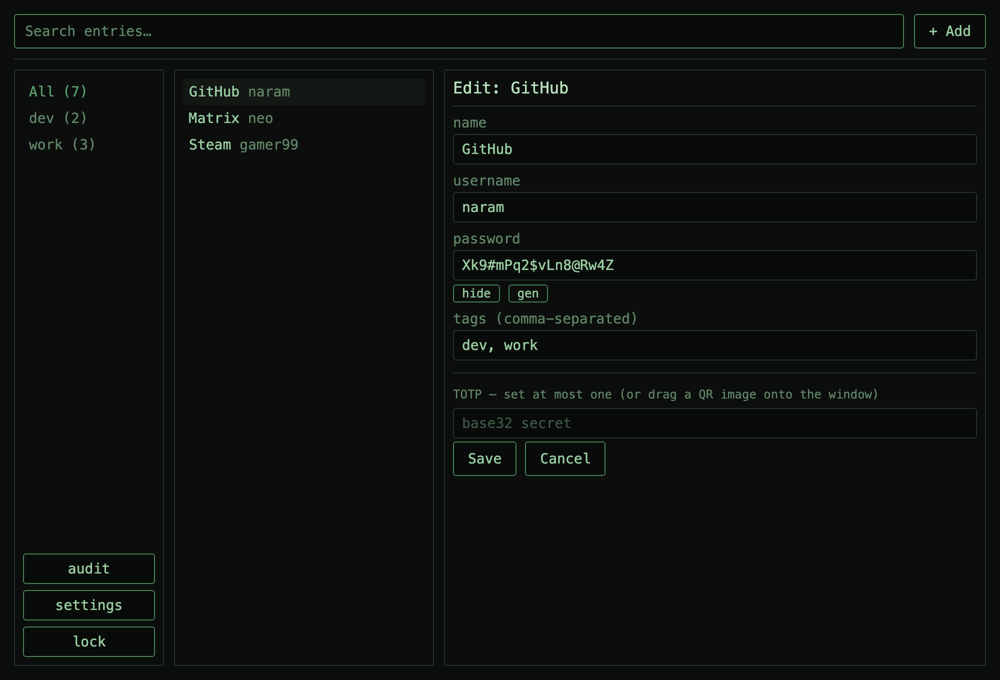
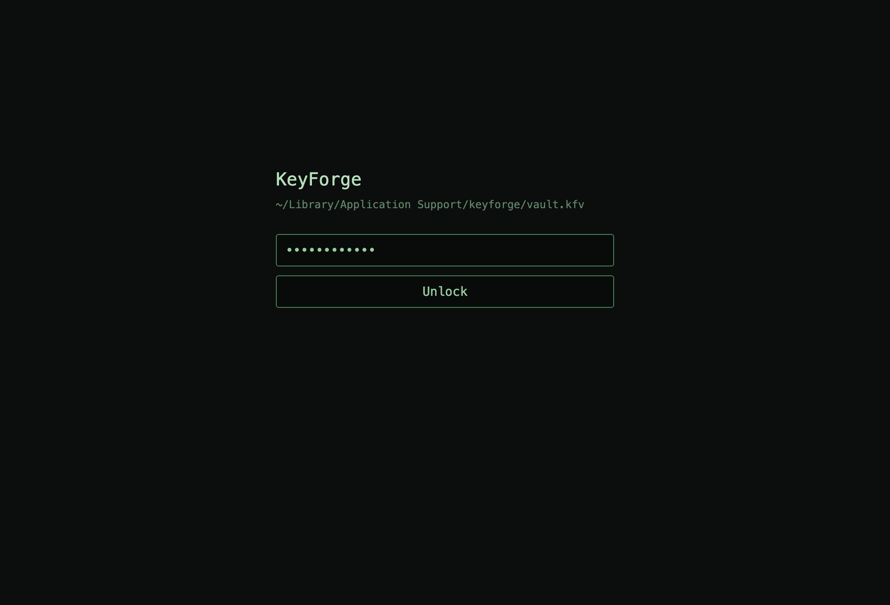

# KeyForge

A **Bitwarden-style password manager written in C++** that runs entirely on
your own machine. One encrypted file, no network, no accounts, no cloud.

A three-pane desktop window with a dark, terminal-style theme: browse your
entries, copy passwords, generate strong ones, and manage two-factor (TOTP)
codes — all offline.

## Screenshots

*Previews rendered from the app's actual layout and theme.*

**Main window** — tag sidebar, searchable entry list, and a detail panel with
copy buttons, password reveal, and a live TOTP code.



**Add / edit an entry** — inline form with a built-in password generator and
TOTP by secret, `otpauth://` URI, or a dropped QR image.



**Unlock** — one master password opens the vault.



## Features

- **Encrypted local vault** — a single file, protected by your master password.
- **Add / edit / delete** entries with username, password, URL, notes, and tags.
- **Password generator** — strong passwords with configurable length and symbols.
- **Two-factor codes (TOTP)** — RFC 6238, enrolled by secret, `otpauth://` URI,
  or by dragging a QR image onto the window. Live code with a countdown.
- **Search and tag filtering** across your whole vault.
- **Vault health audit** — flags weak, reused, and old passwords.
- **CSV import / export** — bring passwords in from Chrome or Bitwarden.
- **Command palette** — press `Ctrl+K` (`Cmd+K` on macOS) for keyboard-driven
  commands; every action is available by typing.
- **Safety** — clipboard auto-clears, the vault auto-locks when idle, and
  secrets are wiped from memory on lock.

## Requirements

- A **C++20 compiler** (Clang or GCC).
- **CMake ≥ 3.24**.
- macOS, Linux, or Windows. All other libraries (libsodium, Dear ImGui, GLFW,
  and a few small ones) are downloaded automatically the first time you build —
  you don't install anything else.

## Build & run

```bash
git clone https://github.com/Visaug36/keyforge.git
cd keyforge

# First build downloads and compiles all dependencies (a few minutes).
cmake -B build -DCMAKE_BUILD_TYPE=Release
cmake --build build -j

# Run the test suite (optional).
./build/tests/core_tests

# Launch the app.
./build/app/keyforge
```

To keep your vault somewhere specific (for example a USB stick), pass a path:

```bash
./build/app/keyforge --vault /path/to/my-vault.kfv
```

On first launch you create a master password. After that, the same password
unlocks the vault. **There is no recovery** — if you forget the master
password, the vault cannot be opened.

> If CMake is very new (4.x) and configure fails on an old dependency, add
> `-DCMAKE_POLICY_VERSION_MINIMUM=3.5` to the `cmake -B build …` line.

## Command reference

Press `Ctrl+K` / `Cmd+K` to open the palette, or just type. `help` shows this
list in-app.

```
add <name> --password P [--username U] [--url U] [--notes N] [--tags t1,t2]
           [--totp-secret S | --totp-uri URI | --totp-qr PATH]
update <name> [same flags as add]
delete <name> --yes
show <name>                    field view, password masked
retrieve <name> [--type password|username|url|notes|totp]   copies to clipboard
totp <name>                    live 6-digit code
list [--tag filter]
gen [--len N] [--no-symbols] [--allow-ambiguous]
audit                          weak / reused / old passwords
export <path>                  encrypted vault backup
import <path> [--format csv]   Chrome/Bitwarden CSV
lock
help
```

## How it works (security model)

- **Vault file:** a `KFV1` header (Argon2id parameters, salt, nonce) followed
  by an XChaCha20-Poly1305–encrypted JSON payload. The entire header is
  authenticated, so any tampering — even with the key-derivation parameters —
  makes decryption fail.
- **Key:** your master password is stretched with Argon2id (libsodium
  `MODERATE`) into a 256-bit key.
- **Atomic saves:** writes go to a temp file, are flushed to disk, then renamed
  into place; the previous version is kept as `vault.kfv.bak`.
- **Memory hygiene:** the key lives in libsodium locked memory and is wiped on
  lock and exit; password input buffers are zeroed after use. Decrypted entry
  data lives in ordinary memory while the vault is unlocked and is dropped on
  lock (full locked-memory storage of every field is out of scope).
- **Clipboard:** auto-clears after a timeout, and only if it still holds the
  value KeyForge copied.
- **Locking:** manual `lock`, auto-lock after idle, and lock on exit.

Default vault location: `~/Library/Application Support/keyforge/vault.kfv`
(macOS), `%APPDATA%\keyforge\vault.kfv` (Windows),
`~/.local/share/keyforge/vault.kfv` (Linux).

## Project layout

```
core/    vaultcore — all logic, no UI (crypto, vault, storage, TOTP, commands)
app/     Dear ImGui + GLFW desktop window
tests/   unit tests for the core (doctest)
docs/    design specs, implementation plans, screenshots
```

The logic lives in a UI-independent `vaultcore` library with its own test
suite; the window is a thin layer on top.

## Status & disclaimer

KeyForge is a personal project built for learning and everyday local use. The
core library is covered by an automated test suite, but it has **not** been
independently security-audited — don't treat it as a hardened replacement for a
mature password manager for high-risk data. Use at your own risk.

## License

MIT — see [LICENSE](LICENSE).
